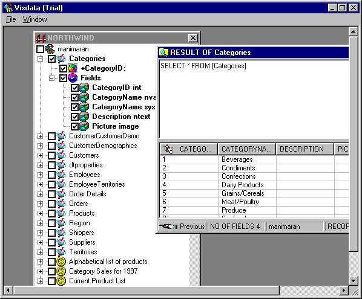



## Data Structre Extract

### Description

This application can Extract the existing DAta structure of any SQL Server database and it can be saved in HTML table format.Tables structure of selective tables can be Printed.Table can be taken copy
 
### More Info
 
The input should be SQL Server.

and any database

Returns HTML tables

             |
---                |---
**Submitted On**   |2001-03-01 20:07:28
**By**             |[Manimaran Subramanian](https://github.com/Planet-Source-Code/PSCIndex/blob/master/ByAuthor/manimaran-subramanian.md)
**Level**          |Advanced
**User Rating**    |5.0 (50 globes from 10 users)
**Compatibility**  |VB 6\.0
**Category**       |[Databases/ Data Access/ DAO/ ADO](https://github.com/Planet-Source-Code/PSCIndex/blob/master/ByCategory/databases-data-access-dao-ado__1-6.md)
**World**          |[Visual Basic](https://github.com/Planet-Source-Code/PSCIndex/blob/master/ByWorld/visual-basic.md)
**Archive File**   |[CODE\_UPLOAD15635312001\.zip](https://github.com/Planet-Source-Code/manimaran-subramanian-data-structre-extract__1-21388/archive/master.zip)

